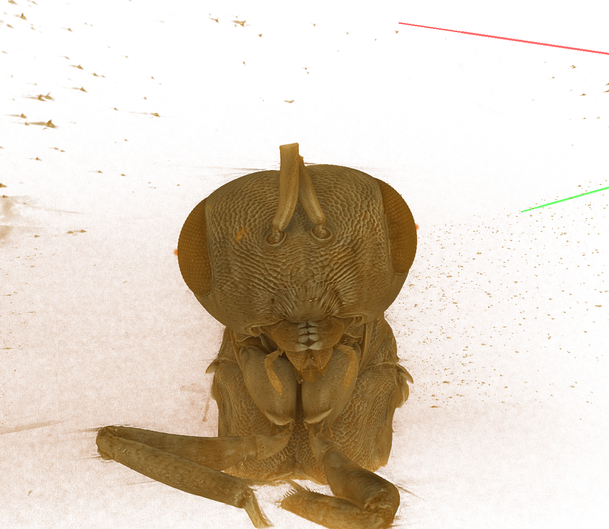

```{r setup, include=FALSE}

knitr::opts_chunk$set(echo = TRUE)

require(dplyr)
require(tidyr)
require(pander)
library(ggplot2)
library(knitr)
library(png)
library(yaml)
library(ggpubr)
library(ggpmisc)
library(tinytex)

nasonia2 <- read.csv(file = 'nasonia2.csv')

```

# Introduction

Parasitoid jewel wasps, which compose the genus *Nasonia*, are well-known model organisms. They demonstrate haplodiploidy (like all other Hymenoptera) which along with size, life span, and tolerance to inbreeding make the genus ideal for study of developmental and behavioral genetics. There are currently four described species of *Nasonia*: *N. vitripennis*, *N. longicornis*, *N. giraulti*, and *N. oneida*. These insects are all indigenous to North America but experience reproductive isolation we expect to be prezygotic. They are known for unique courtship behaviors where males respond to discerning females with a species-specific number of head nods, plus duration, and frequency of nodding with mouthpart extrusion. This behavior is speculated to play a role in semiochemical expression from newly discovered glands, recieved by female antennae. Gland size seems to correspond with craniofascial abnormalities which have extended the head capsule laterally while enlarging a cheek-like space between the compound eyes and mandibles bilaterally.  



Interestingly, species with larger "cheeks" and glands demonstrate more head nods. Our study has identified a glandular epithelial lining adjacent to cuticular invaginations on either side of the mandibulae. Using synchrotron-based micro-CT and serial block face scanning electron microscopy, we measured the gland reservoir volumes (GV) of three *Nasonia* species plus maximum head width (MHW), a proxy for overall head and body size. We speculate that the forementioned morphometrics are distinct, with statistical significance, between not only sexes, but species within sex as well.This would tie several phenotypic presentations together: glandular volume, courtship behavior, and the craniofascial mutation(s) that would have initiated the aphrodisiacal phenomenon.  


```{r introimgs, echo = FALSE, fig.show = "hold", out.width = "50%", fig.align = "default", fig.cap = "Left: An image captured from micro-CT scan of a Nasonia giraulti male specimen demonstrates described characters (md=mandible, ec=epidermal cells, res=reservoir, inv=invagination). Right: Sexual and specific differences in invagination and glandular epitheliae. A-D: female *Nasonia*, *N. vitripennis*, *N.longicornis*, and *N. giraulti"}

knitr::include_graphics("giraultiimg.png")

knitr::include_graphics("nasoniaglanddrawings.png")

```

Initially, it was thought that female *Nasonia* specimens would not possess a glandular epithelium in the mandibular invagination at all. Upon taking a closer look it became apparent that although the glandular epithelium is indeed present, but it is not detached from the exoskeleton which would create a glandular reservoir as seen in males. This sexual dimorphism is demonstrated in Figure 2. where male and female maximum head width broadly vary while female gland volume is strictly minimal. In this study we ask whether gland volume and maximum head width morphometrics significantly vary between species of *Nasonia*, and predict that it is true. We hypothesize that if courtship behavior varies by species, then the cranial morphometrics associated with the aphrodisiac will as well.  

```{r malefemalescatter, echo = FALSE, fig.cap="Sexual dimorphism is can be identified in gland volume."}

ggplot(nasonia2, aes(x=MHW , y=GV, color=sex))+
  geom_point()+

theme(legend.position = 'top',
        legend.direction = 'vertical') +
      theme_minimal()+
    labs(y= 'Gland Volume',
         x = 'Maximum Head Width',
         title = 'Gland Volume by Maximum Head Width')

```

Since gland volume is a more meaningful metric in male specimens, separating our sample population by sex makes sense. Exploration of the data continues where gland volume and maximum head width are plotted, and species-based clusters can be identified.

```{r malescatter, results='hide', echo = FALSE, fig.cap="Three distinct clusters of data points represent the three species of male specimens."}

nasonia2$MHW / nasonia2$GV

nasonia3 <- nasonia2

nasonia3$indexValue <- nasonia3$MHW / nasonia3$GV

nasonia3$group <- paste(nasonia3$sex, nasonia3$specificEpithet)

femaleonly <- filter(nasonia3, sex =="female")

maleonly <- filter(nasonia3, sex =="male")

ggplot(data=maleonly, aes(x=MHW, y=GV, color=specificEpithet))+
geom_point()+
 geom_smooth(method=lm , color="black", fill="#CCCCCC", se=TRUE)+

theme(legend.position = 'top',
        legend.direction = 'vertical') +
      theme_minimal()+
    labs(y= 'Gland Volume',
         x = 'Maximum Head Width',
         title = 'Male Nasonia spp. Craniofascial Morphometrics')

```

```{r groupindexvalue , echo = FALSE, warning=FALSE, message=FALSE, results='hide', fig.cap="Index value is a function of both maximum head width and glandular volume. Differences in index values are shown between sexes and species."}

group_by(nasonia3, group) %>%
  summarise(
    count = n(),
    mean = mean(indexValue, na.rm = TRUE),
    sd = sd(indexValue, na.rm = TRUE),
    median = median(indexValue, na.rm = TRUE),
    IQR = IQR(indexValue, na.rm = TRUE)
  )

ggboxplot(nasonia3, x = "group", y = "indexValue", 
          color = "sex", palette = c("#00AFBB","#E7B800"),
          order = c("female giraulti", "female longicornis", "female vitripennis", "male giraulti", "male longicornis", "male vitripennis"),
          ylab = "Index Value", xlab = "Nasonia Species")+
  
  scale_x_discrete(labels=c("female giraulti" = "giraulti", "female longicornis" = "longicornis",
                              "female vitripennis" = "vitripennis", "male giraulti" = "giraulti", "male longicornis" = "longicornis", "male vitripennis" = "vitripennis"))

```

```{r group mean indexvalues, echo = FALSE, fig.cap="Mean index values are represented for each sex and species group."}

ggline(nasonia3, x = "group", y = "indexValue", 
       add = c("mean_se", "jitter"),
       color = "sex", palette = c("#00AFBB","#E7B800"),
       order = c("female giraulti", "female longicornis", "female vitripennis", "male giraulti", "male longicornis", "male vitripennis"),
       ylab = "Index Value", xlab = "Nasonia Species")+
  
   scale_x_discrete(labels=c("female giraulti" = "giraulti", "female longicornis" = "longicornis",
                              "female vitripennis" = "vitripennis", "male giraulti" = "giraulti", "male longicornis" = "longicornis", "male vitripennis" = "vitripennis"))

```

# Methods

Serial block-face scanning electron microscopy were used to generate high resolution TIFF image sequences. Fiji ROI manager and segmentation editor were used to annotate intermittent slices of the mandibular gland and interpolate the gland boundaries between the manually outlined slices. The surface area of each outline was summed in Microsoft Excel and this value was multiplied by the slice spacing (1.22 micrometers) to calculate the volume of the gland.  

Synchrotron-based micro-CT generated TIFF image sets were combined into processed volume files in Drishti Import, and modeled in Drishti. Maximum head width was measured in Drishti using the path measurement function between landmark points in three dimensions.

Statistical analysis of differences in gland volume and maximum head width between sexes and species requires one continuous dependent variable. This is achieved by creating an "index value", generated by dividing maximum head width by gland volume. Further visualization of the data in box and two-way interaction plots inform statistical test type for analysis.

The relationship between the index values and sex and species can be explored through parametric two-way ANOVA. **This meets the assumptions that:**

\begin{itemize}
\item[] 1. The dependent variable – here, “index value”, is continuous.
\item[] 2. Two two independent variables – here, “species” and “sex”, are in categorical, independent groups.
\item[] 3. Sample independence – each sample has been drawn independently of the other samples.
\item[] 4. Variance Equality – the variance of data in the different groups is the same.
\item[] 5. Normality – each sample is taken from a normally distributed population.  

\end{itemize}

**The hypotheses tested here are:**

\begin{itemize}

\item[] H0: The means of all species groups are equal
\item[] H1: The mean of at least one species group is different  

\item[] H0: The means of the sex groups are equal
\item[] H1: The means of the sex groups are different  

\item[] H0: There is no interaction between the species and sex 
\item[] H1: There is interaction between the species and sex  

\end{itemize}

If a null hypothesis is true, the F value generated is likely to be close to 1.0. If a null hypothesis is not true, the F value is likely to be greater than 1.0. 
# Results  

In the table below, we see an F value well greater than 1 for the variable of sex, which rejects the null hypothesis and instead supports the idea that the means of sex groups are different. The F value for species is 1.384, much closer to but still greater than 1. This supports our hypothesis that the mean of at least one species group is likely different from the others. The p-values represented by "Pr(>F)" for species and sex are greater than and less than a 0.05 significance level respectively. This indicates that the probability of differences in index values is more likely influenced by sex than species.  

```{r twowayanova, echo = FALSE, warning=FALSE, message=FALSE, results='hide', fig.keep='all'}

model <- lm(indexValue ~ specificEpithet + sex, data=nasonia3 )

pander(anova(model))

```

To investigate the relationship between species and index value further, we focus on the male specimens only with a nonparametric Kruskal-Wallis test and a pairwise Wilcoxon test.

```{r maleonly, echo = FALSE, warning=FALSE, message=FALSE, results='hide', fig.keep='all', fig.show="hold", out.width="50%"}

group_by(nasonia3, group) %>%
  summarise(
    count = n(),
    mean = mean(indexValue, na.rm = TRUE),
    sd = sd(indexValue, na.rm = TRUE),
    median = median(indexValue, na.rm = TRUE),
    IQR = IQR(indexValue, na.rm = TRUE)
  )

ggboxplot(nasonia3, x = "specificEpithet", y = "indexValue", 
          color = "specificEpithet", palette = c("#00AFBB","#E7B800", "#FC4E07"),
          order = c("giraulti", "longicornis", "vitripennis"),
          ylab = "Index Value", xlab = "Nasonia Species")+
  
  scale_x_discrete(labels=c("giraulti" = "giraulti", "longicornis" = "longicornis", "vitripennis" = "vitripennis"))

ggline(nasonia3, x = "specificEpithet", y = "indexValue", 
         order = c("giraulti", "longicornis", "vitripennis"),
       add = c("mean_se", "jitter"),
        color = "specificEpithet", palette = c("#00AFBB", "#E7B800", "#FC4E07"),
       ylab = "Index Value", xlab = "Nasonia Species")+
  
    theme(legend.position = 'top',
        legend.direction = 'vertical') +
      theme_minimal()+
    labs(y= 'Index Value',
         x = 'Species',
         title = 'Male Nasonia Index Values')

```


```{r kruskal, echo = FALSE, warning=FALSE, message=FALSE}

ktest <- kruskal.test(indexValue ~ specificEpithet, data = maleonly)

pander(ktest)

```


```{r pairwise wilcox, echo = FALSE, warning=FALSE, message=FALSE}

wilcoxtest <- pairwise.wilcox.test(maleonly$indexValue, maleonly$specificEpithet,
                 p.adjust.method = "BH")

pander(wilcoxtest)

```
Our Kruskal-Wallis rank sum test produced a p-value of 3.924e-06, which is less than the significance level 0.05. This value allows us to conclude significant differences in index values between male *Nasonia* species. The pairwise Wilcoxon test shows p-values less than 0.05 for all combinations of species indicating significant differences in all male comparisons.  

# Discussion

The genus *Nasonia* is a long-standing model organism for the study of developmental and behavioral genetics. While their genome is more accessible than ever, phenotypic representations require further description. The wasp's courtship behavior, observation of head shape and size, plus the newly discovered mandibular gland are seemingly connected but with what significance? Duration/nod count of courtship behavior has been discovered to have a positive relationship with gland volume. This may be due to a mechanical limiting factor for the expression of aphrodisiac pheromones that requires extended nodding for evacuation of a larger gland reservoir. Although glandular epithelial tissue is present in the facial invaginations of female *Nasonia*, our data shows that gland volume in females is insignificant. The two morphometrics explored here, gland volume and maximum head width, are represented for statistical analysis as a ratio index value. A parametric two-way ANOVA test showed statistically significant differences between index values grouped by sex as well as by species. In males, interspecific variation was explored using a non-parametric Kruskal-Wallis and Wilcoxon rank sum tests. Both of these tests indicated statisticall significant differences in index values between males of the *Nasonia* species included in this study.  

There may be a connection between certain craniofacial abnormalities mapped in the *Nasonia* genome and the phenotypes of mandibular gland volume and courtship behavior previously described. Further study should be done to examine head shape in addition to width, incuding FE and FEP measurements with a standardized data collection method for all species. Quantification of courtship behavior should be included with index value analysis in the future. Additionally, the most recently described species, *Nasonia oneida* should be included in future studies for more diverse data inclusion.   

# References  

[1] Földvári, M., Mikó, I., Ulmer, J.M., dos Santos Rolo, T., Csősz, S., Pomiankowski, A., Baumbach, T. and van de Kamp, T., 2019. Jumping and Grasping: Universal Locking Mechanisms in Insect Legs. Insect Systematics and Diversity, 3(6), p.3.

[2] Gadau, J., Page, R. E., & Werren, J. H. (2002). The genetic basis of the interspecific differences in wing size in Nasonia (Hymenoptera; Pteromalidae): major quantitative trait loci and epistasis. Genetics, 161(2), 673-684.

[3] Li, M., Au, L. Y. C., Douglah, D., Chong, A., White, B. J., Ferree, P. M., & Akbari, O. S. (2017). Generation of heritable germline mutations in the jewel wasp Nasonia vitripennis using CRISPR/Cas9. Scientific reports, 7(1), 1-7.

[4] Mikó, I., & Deans, A. R. (2014). The mandibular gland in Nasonia vitripennis (Hymenoptera: Pteromalidae). BioRxiv, 006569.

[5] Noirot, C., & Quennedey, A. (1974). Fine structure of insect epidermal glands. Annual review of entomology, 19(1), 61-80.

[6] Stökl, J., & Herzner, G. (2016). Morphology and ultrastructure of the allomone and sex-pheromone producing mandibular gland of the parasitoid wasp Leptopilina heterotoma (Hymenoptera: Figitidae). Arthropod structure & development, 45(4), 333-340.

[7] Trietsch, C., Miko, I., Ulmer, J.M. and Deans, A.R. (2017). Translucent cuticle and setiferous patches in Megaspilidae (Hymenoptera, Ceraphronoidea). Journal of Hymenoptera Research, 60, p.135.

[8] Van den Assem, J., Jachmann, F., & de Jong, K. A. G. (1981). COURTSHIP BEHAVIOUR OF NASONIA VITRIPENNIS: HEAD NODDING, MOUTH‐PART EXTRUSION AND PHEROMONE DISCHARGE BY ABDOMECTOMIZED MALES. Entomologia Experimentalis et Applicata, 30(3), 215-218.

[9] Van den Assem, J., & Werren, J. H. (1994). A comparison of the courtship and mating behavior of three species of Nasonia (Hymenoptera: Pteromalidae). Journal of Insect Behavior, 7(1), 53-66.

[10] Xia, S., Pannebakker, B. A., Groenen, M. A., Zwaan, B. J., & Bijma, P. (2020). Quantitative genetics of wing morphology in the parasitoid wasp Nasonia vitripennis: hosts increase sibling similarity. Heredity, 125(1), 40-49.
